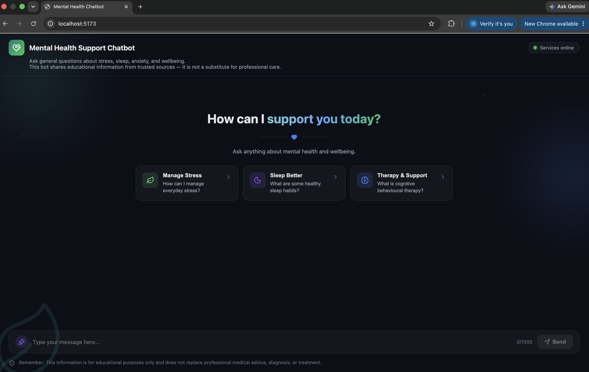
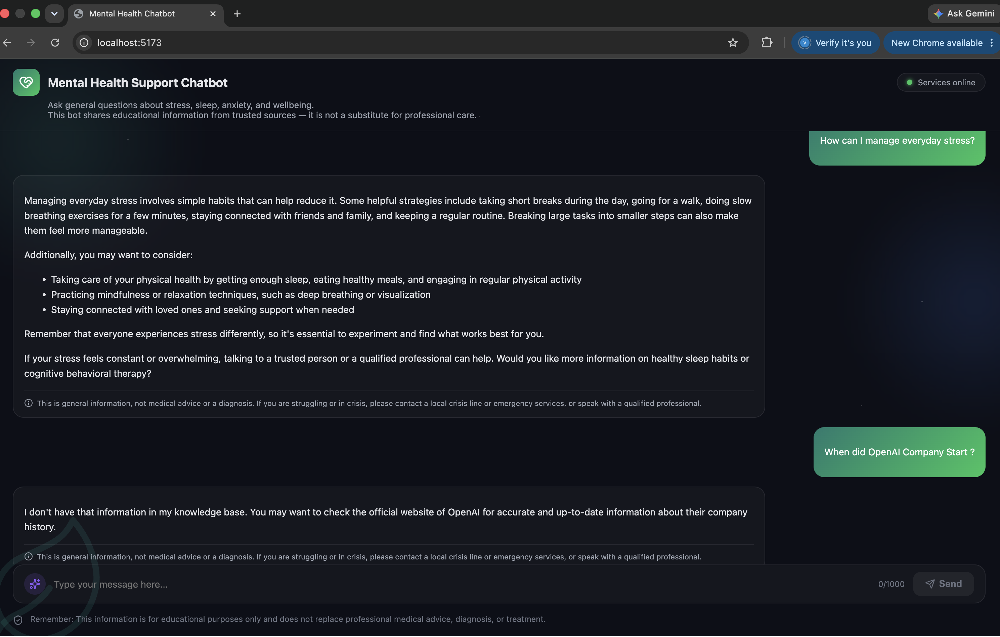

# AI-Powered-Mental-Health-Support-Chatbot (Local RAG System)

## Project Overview

The Mental Health Support Chatbot is a full-stack Retrieval-Augmented Generation (RAG) system designed to provide educational and informational responses to mental health-related queries. The system retrieves relevant context from trusted sources such as WHO guidelines and CBT-based materials and generates grounded responses using a locally deployed Large Language Model.

The project is designed with a production-style architecture using a fully local AI stack to ensure zero API cost, improved privacy, and offline capability.

---

## Demo - Screenshot



<br />




---

## System Architecture

```text id="arch_ollama"
User
  ↓
React Frontend
  ↓
FastAPI Backend
  ↓
RAG Pipeline
  ├── Document Processing (PyPDF)
  ├── Text Chunking
  ├── Embedding Generation (Sentence Transformers)
  ├── Vector Search (Qdrant)
  └── Context Retrieval
  ↓
Local LLM (Ollama: Llama 3.1)
  ↓
Generated Response
  ↓
User
```

---

## Tech Stack

### Frontend

- React
- Axios
- CSS / Tailwind (optional)

### Backend

- FastAPI
- Uvicorn
- Pydantic

### AI & NLP

- Sentence Transformers
- bge-m3 OR all-MiniLM-L6-v2
- Local LLM via Ollama (Llama 3.1 / Mistral)

### Retrieval System

- Qdrant Vector Database
- PyPDF for document ingestion

### Development Tools

- GitHub
- GitHub Actions (CI/CD)
- GitHub Copilot (AI-assisted coding)
- Claude Code (AI-assisted development support)

---

## Key Features

- Retrieval-Augmented Generation (RAG) pipeline
- Fully local LLM inference using Ollama
- Semantic search using Qdrant vector database
- Context-aware mental health responses
- Modular FastAPI backend architecture
- Clean React-based conversational UI
- Source-grounded responses (WHO + CBT documents)
- Zero API cost system (fully offline-capable)

---

## Why This Architecture

This system follows a modern AI engineering approach by separating:

- UI Layer → React
- API Layer → FastAPI
- Retrieval Layer → Qdrant
- Reasoning Layer → Local LLM (Ollama)

This design improves scalability, maintainability, privacy, and removes dependency on external paid APIs.

---

## Safety Disclaimer

This chatbot is intended for educational and informational purposes only. It does not provide medical diagnosis, treatment, or emergency mental health support.

---

## AI-Assisted Development

This project was developed with assistance from:

- GitHub Copilot for code generation and autocomplete support
- Claude Code for architectural suggestions, debugging support, and implementation guidance

---

## Author

Vidhi Sheth

Senior Full-Stack Software Engineer | .NET, Angular, React, SQL Server, Azure | Cloud-Native & AI-Enabled Enterprise Applications | Healthcare, Insurance & FinTech

## 

This is a private repository. If you'd like a live demo or code walkthrough, feel free to reach out.

